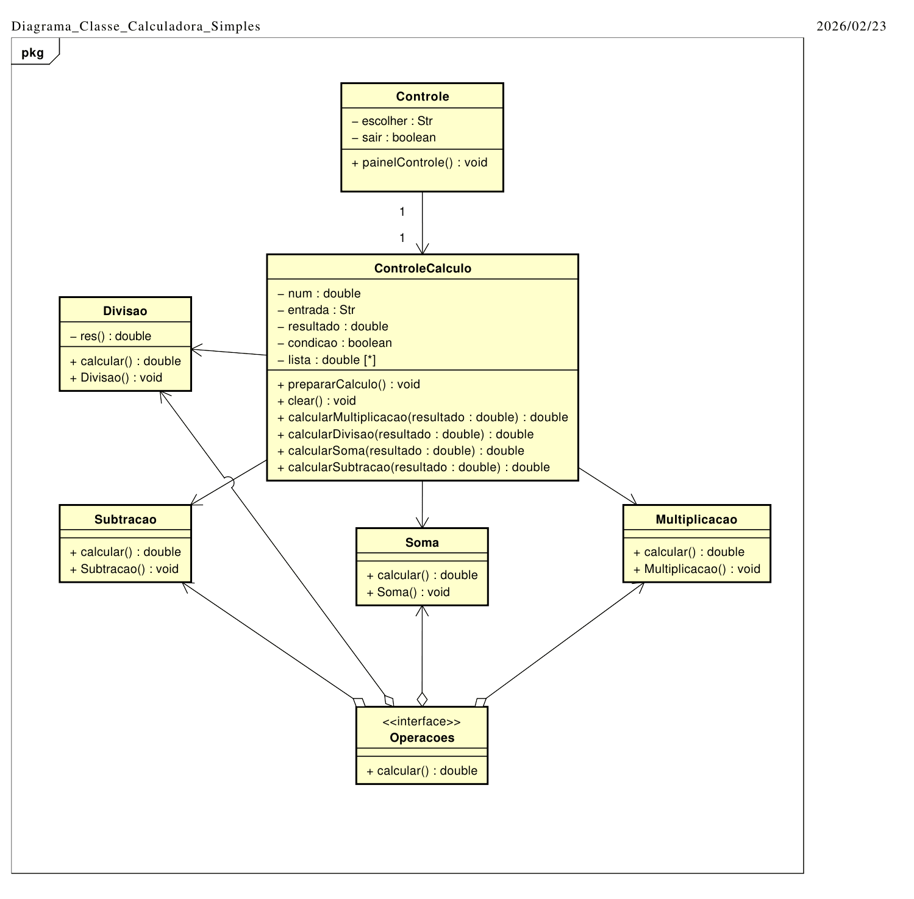

# Calculadora Complexa 
Autor: Mailton Olinto de Oliveira Lemos

## Visão Geral:

Este projeto tem como objetivo o desenvolvimento de uma calculadora das quatro operações matemáticas básicas: soma, subtração, multiplicação e divisão. Os cálculos são encadeados, assim não reiniciam ao obter os resultados.
Para fornecer uma experiência agradável ao usuário, há uma função de limpar os cálculos e um menu interativo em 'loop' para alternar entre as operações matemáticas.
O software desenvolvido serve de estudo, treinamento e portfólio do autor.

## Arquitetura do Sistema

O projeto foi feito no padrão Maven em Java 21 puro, utilizando o paradigma da Orientação a Objetos, heranças e interface.
As classes foram cuidadosamente separadas em suas funções para evitar acúmulo de responsabilidades em uma única classe. 

## Descrição dos Componentes (Classes)

### Interface Operacoes

Define o contrato 'calcular()' que está presente em todas as classes que operam cálculo. É do tipo double para aceitar números quebrados e grandes.

### ControleCalculo 

O cérebro do sistema. Ele chama cada lógica de cálculo, trata exceções, implementa a função 'Clear' e encadeia os números calculados.

### O método de cálculo básico funciona assim:

1. **Se inicia um loop com um boolean.**
2. **Chama o método prepararCalculo(),** que encadeia os números das diferentes operações:
ele pega o último resultado calculado, limpa a lista antiga (mantendo o resultado) e torna o resultado como o novo ponto de partida.
3. **Ao usuário inserir um dígito válido,** os dígitos String são convertidos para double.
4. **Os números são salvos numa ArrayList** do tipo Double (lista). 
5. **Ao digitar '='** o sistema instancia a classe da operação pertencida e inicia o método de cálculo.

Receber a entrada do usuário em String e depois converter para double permite que o usuário digite '=' para receber os resultados dos cálculos.

## Fluxo de Execução

## Tratamento de Erros e Exceções

## Tecnologias e Ferramentas

## Guia de Extensibilidade
